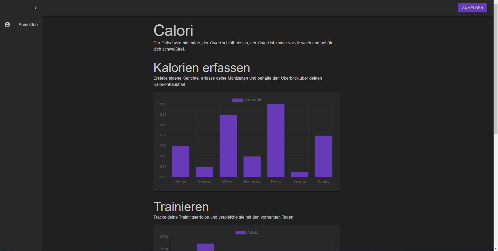
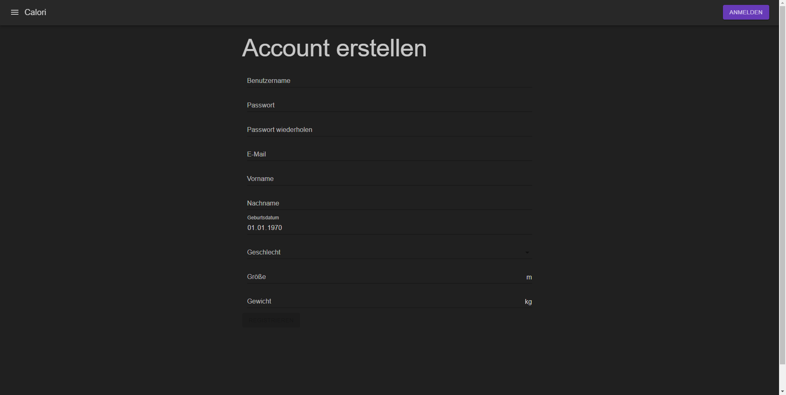
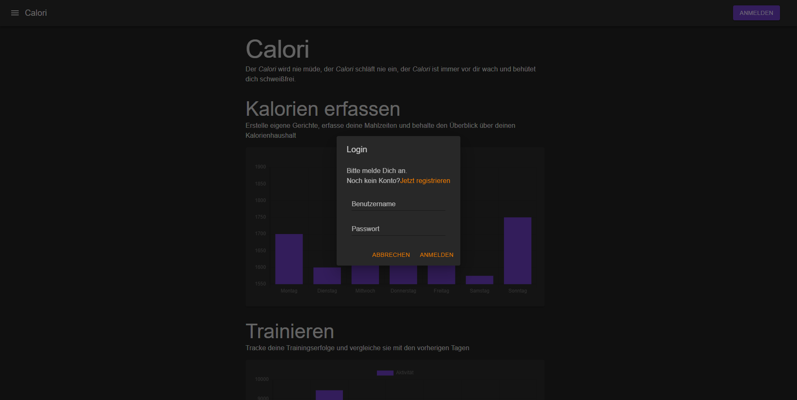
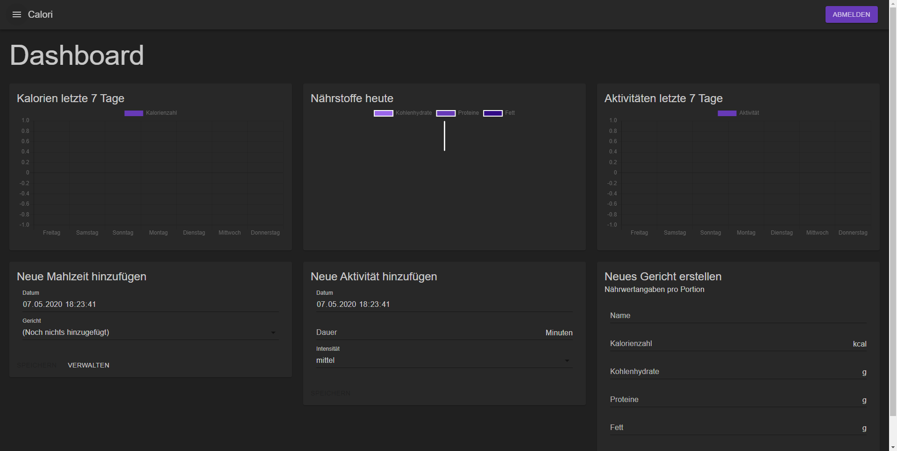
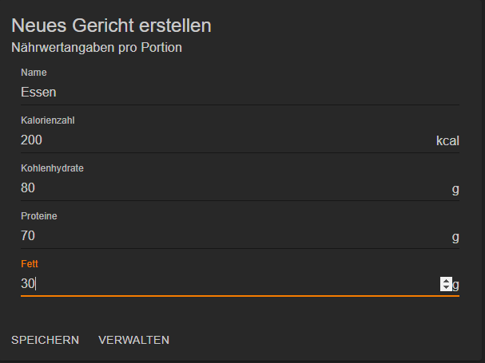
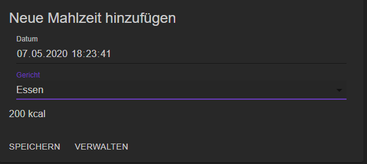
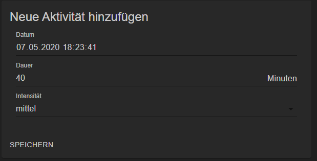
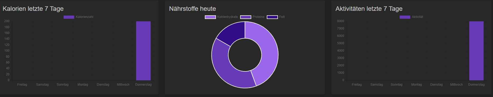
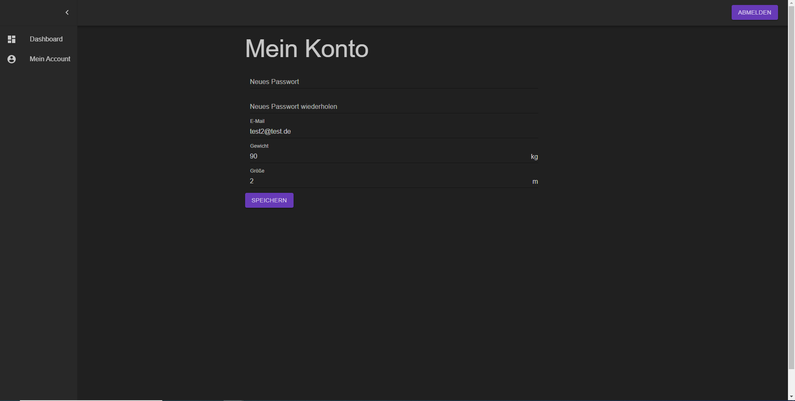

# Projekt

Calori ist das perfekte Tool um einen Überblick über den eigenen Kalorierenhaushalt zu behalten.

## Setup und Testing

Nach dem Klonen müssen einmalig alle Abhängigkeiten mit `npm i` installiert werden.

### Development-Server

Unter Windows kann es evtl. zu Problemen mit dem Development-Server kommen, was höchstwahrscheinlich auf die Windows-Firewall zurückzuführen ist.
In diesem Fall empfiehlt es sich, das Windows Subsystem for Linux zu verwenden.

1. Den Frontend-Server mit `npm run-script dev:frontend` starten
2. Den Hauptserver mit `npm run-script dev` starten

Der Frontend-Serever wird vom Hauptserver geproxied, welcher standardmäßig auf Port `8000` lauscht. Die App kann im Browser unter `localhost:8000` aufgerufen werden.

### Production-Server

1. Das Frontend mit `npm build` bauen
2. Den Hauptserver mit `npm start` starten
3. In einer Produktivumgebung kann man z.B. mithilfe von Nginx einen Reverse-Proxy bereitstellen, der sich um SSL kümmert. Der Hauptserver lauscht standardmäßig auf Port `8000`.

## Beschreibung

Features:

Vom Index ausbeginnend hat der User die Möglichkeit sich zu...

Registrieren oder wenn er schon einen Account besitzt, sich...

anzumelden. 

Nach dem Login wird auf diese View weitergeleitet. In dieser View hat der Nutzer direkten Einblick auf alle zentralen Features.
Der User kann jetzt die erste Mahlzeit hinzufügen.

Hat man die Mahlzeit erstellt, so kann man diese nun zu den "heute gegessenen hinzufügen".

Ein weiteres zentrales Feature für den User ist nun, dass er seine Bewegung "tracken" kann.

Nun sind genung Daten vorhanden, dass sich ein erster Blick auf die Auswertung lohnt.

Selbstverständlich kann man als User seine bei der Registrierung angegeben Daten noch ändern.

